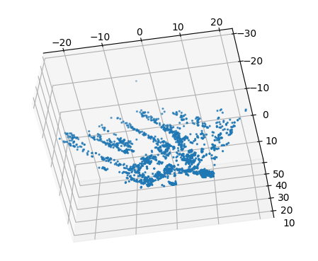

# Simplified SFM
| Frame1    | Frame2       |
| -------------- | -------------- |
 |   

##### 1. Keypoints matching: SIFT , Flann based matching

##### 2. Estimate Fundamental matrix, Essential matix

##### 3. Recover Camera pose and triangulate the matched points in world coordinates, camera chirality

##### 4. !!!Missing Bundle Adjustment

### Key points matched

### matplotlib visualization

